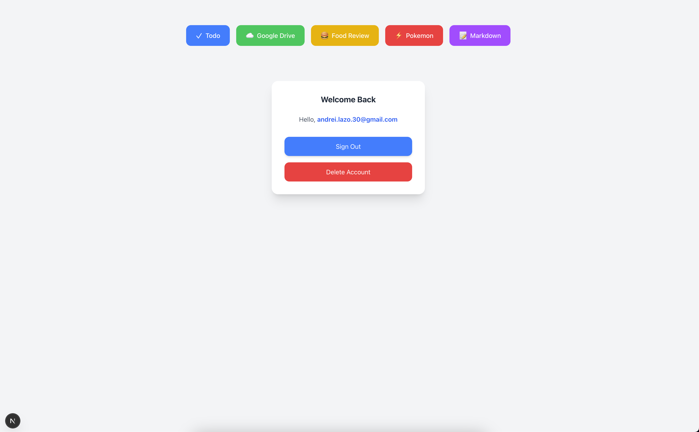
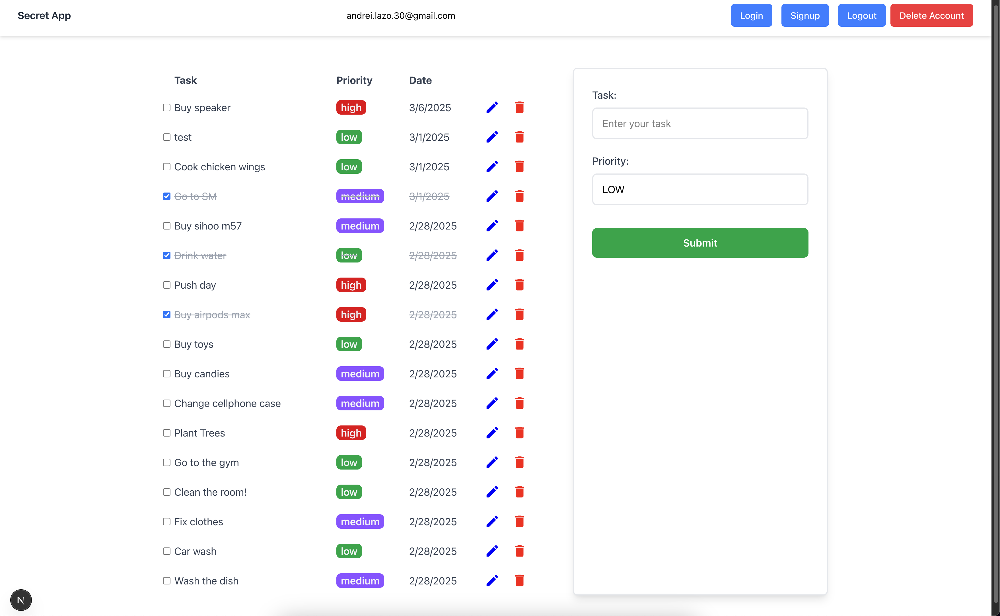
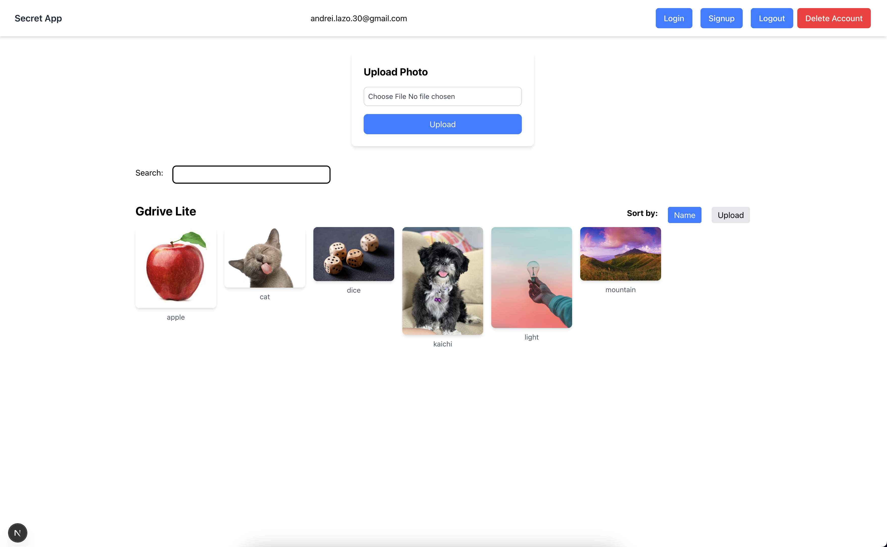
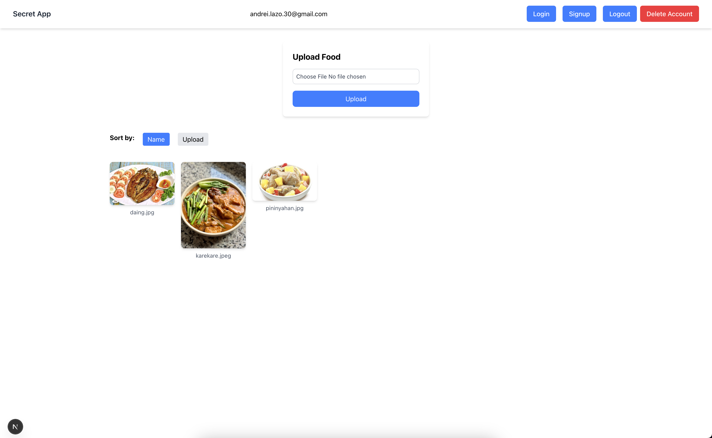
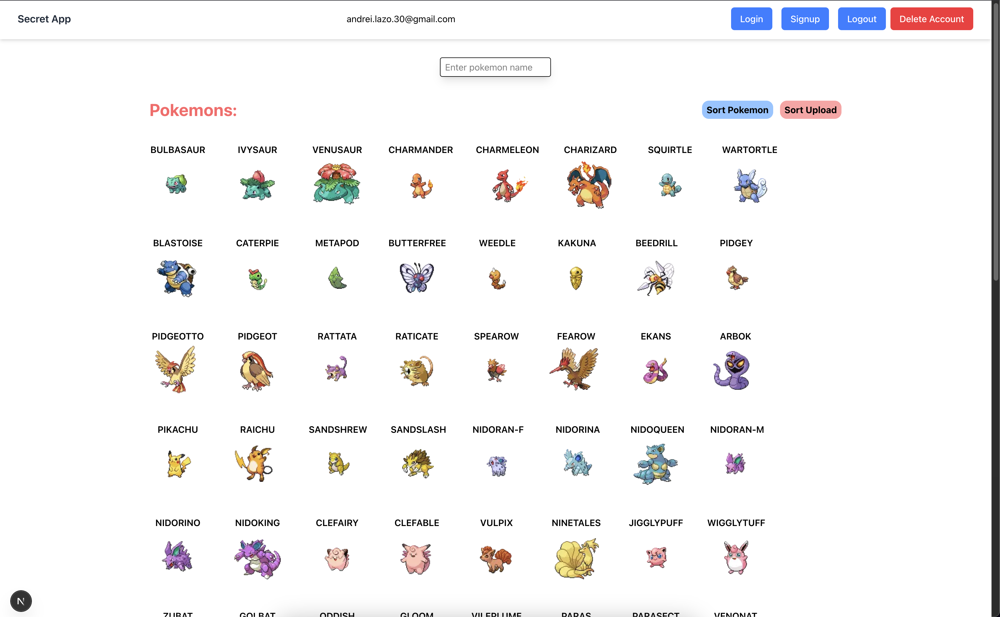
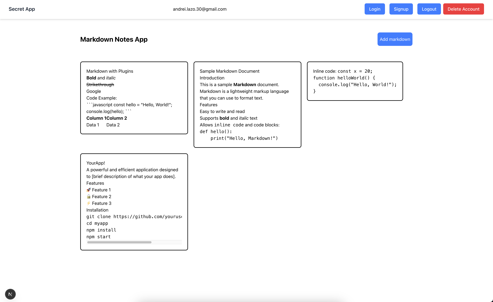

# Features

## Index

## Todo App

- Add (priority), edit, and delete tasks
- Mark tasks as completed

## Google Drive Lite

- Searching using the params(useSearchParams)
- Upload, delete, edit files
- Sort by name and date upload

## Food Review App

- Add edit delete food
- Review the food through a comment
- CRUD comments
- Sort by name and date upload

## Pokémon Review App

- Display list of 100 pokemons from external api (poke.api)
- Sort pokemon by name/upload_date
- Review pokemon through comment(CRUD)
- Search for pokemon with the use of input attached to the params

## Markdown Notes App

- Create, edit and delete notes with Markdown
- Save and manage notes
- Visualize markdown when adding
